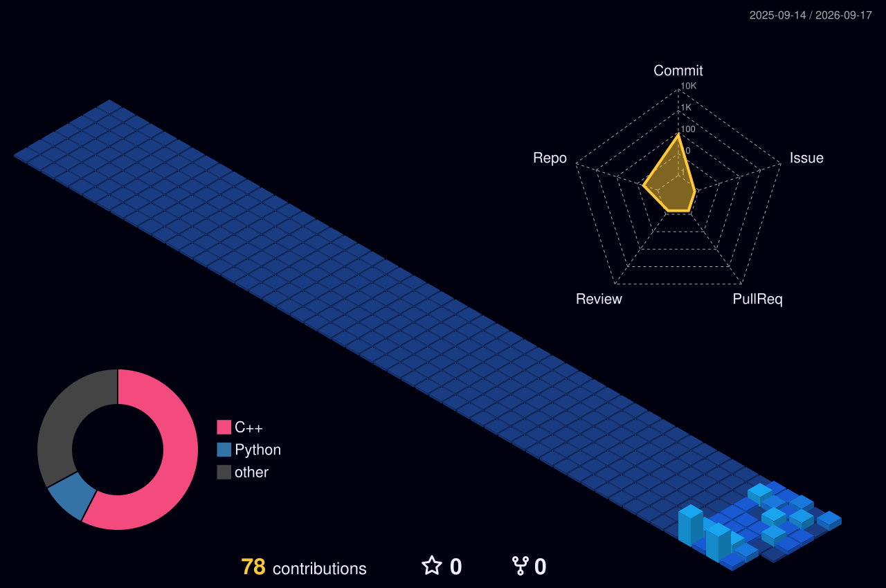

# Hi, I'm Arin Upadhyay 👋

### 🛠️ Tech Stack
| Category | Stack |
| :--- | :--- |
| **Languages** |    |
| **Web & Tools** |     |

---

### 📊 GitHub Stats

  
  

---

### 🐍 Contribution Snake

---

### 🏙️ 3D Contribution Graph

